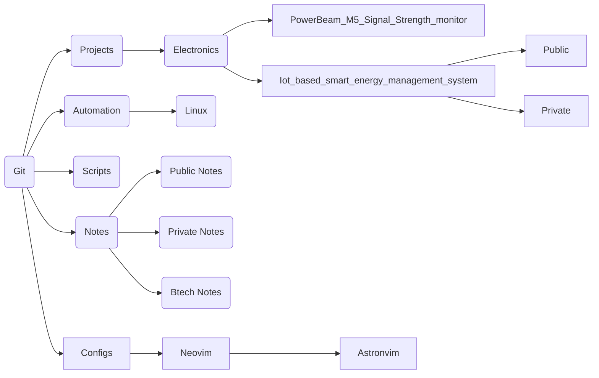

```mermaid

graph LR
A(Git) --> B(Projects)
B --> F(Electronics)
A --> C(Automation)
C --> D(Linux)
A --> E(Scripts)
A --> N(Notes)
F --> G[PowerBeam_M5_Signal_Strength_monitor ]
click G "https://github.com/aruncs31s/PowerBeam_M5_Signal_Strength_monitor" "Goto Link"

F --> H[Iot_based_smart_energy_management_system] --> HH[Public]
H --> HG[Private]
N --> L(Public Notes)
N --> M(Private Notes)
N --> O(Btech Notes)

A --> P[Configs]
P --> Q[Neovim]
Q --> QQ[Astronvim]

click L "https://github.com/aruncs31s/Notes" "Notes"
click M "https://github.com/aruncs31s/Private_Notes" "Private Notes"
click O "https://github.com/aruncs31s/BtechEC" "Btech Notes"
```
